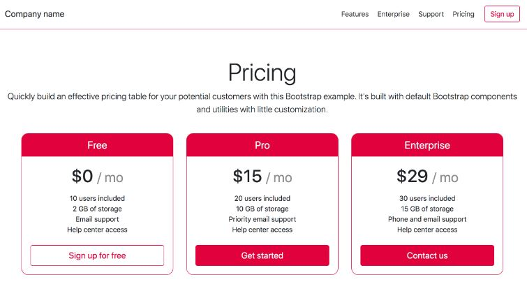

# 0x0A-Bootstrap

## This is a project to practice Bootstrap utilities for responsive design in web pages

### Blocks

### Table of chemical elements

### Cards

### Musician and discography

### CSS Responsive Design

